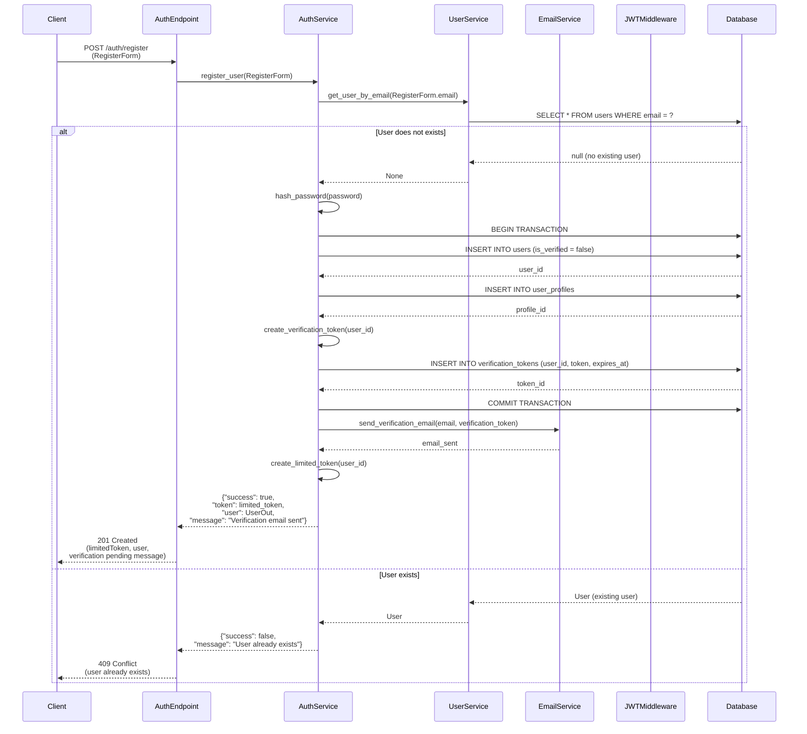
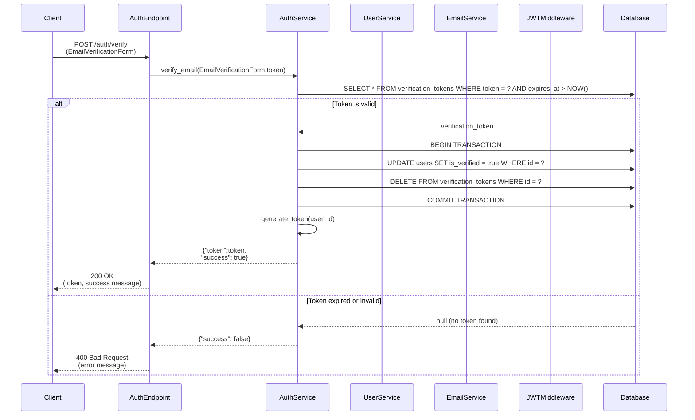
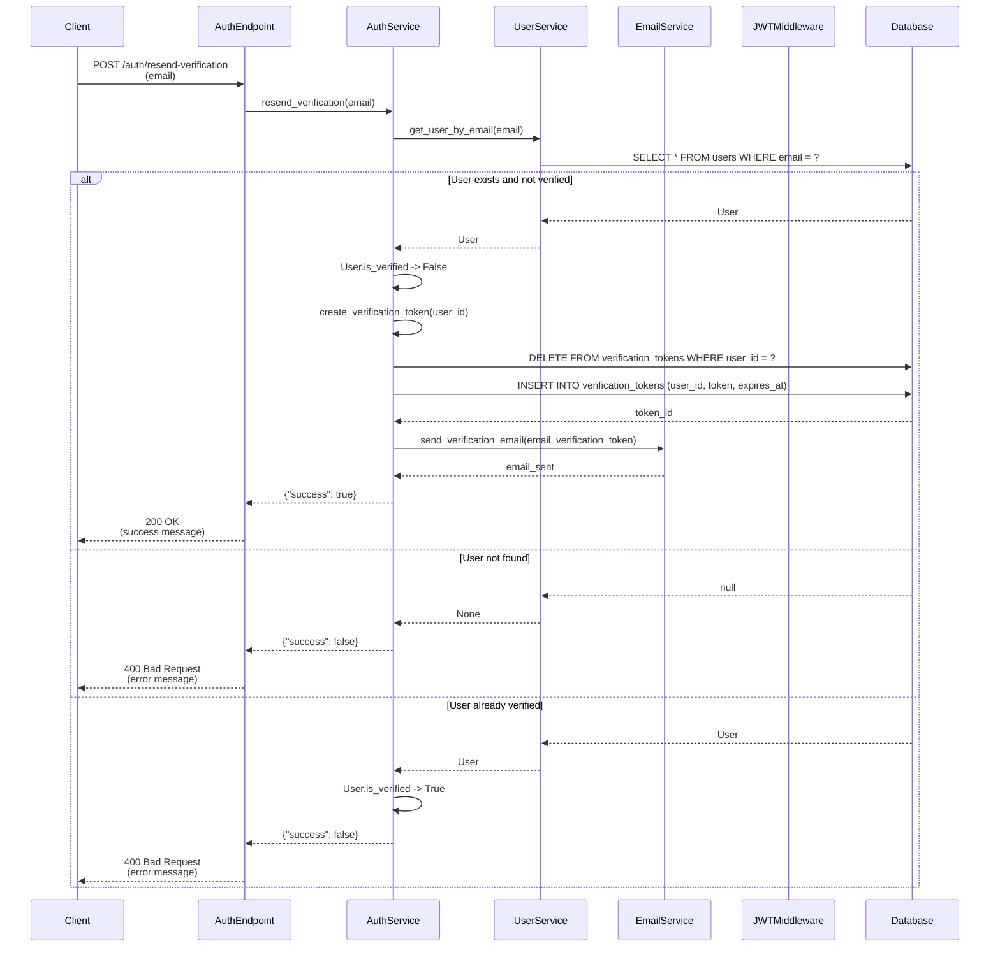
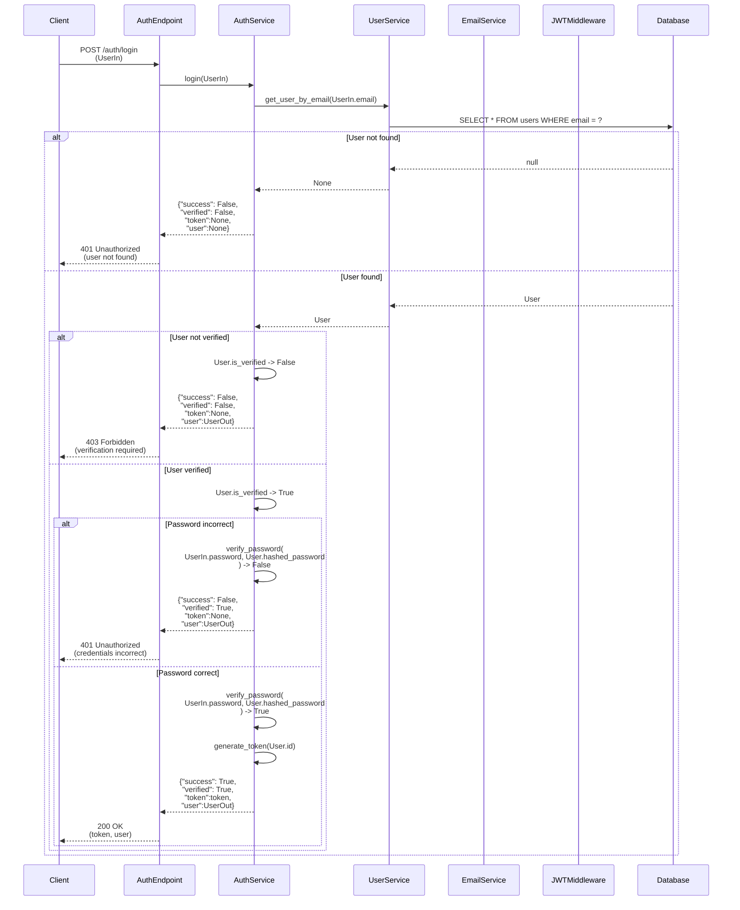
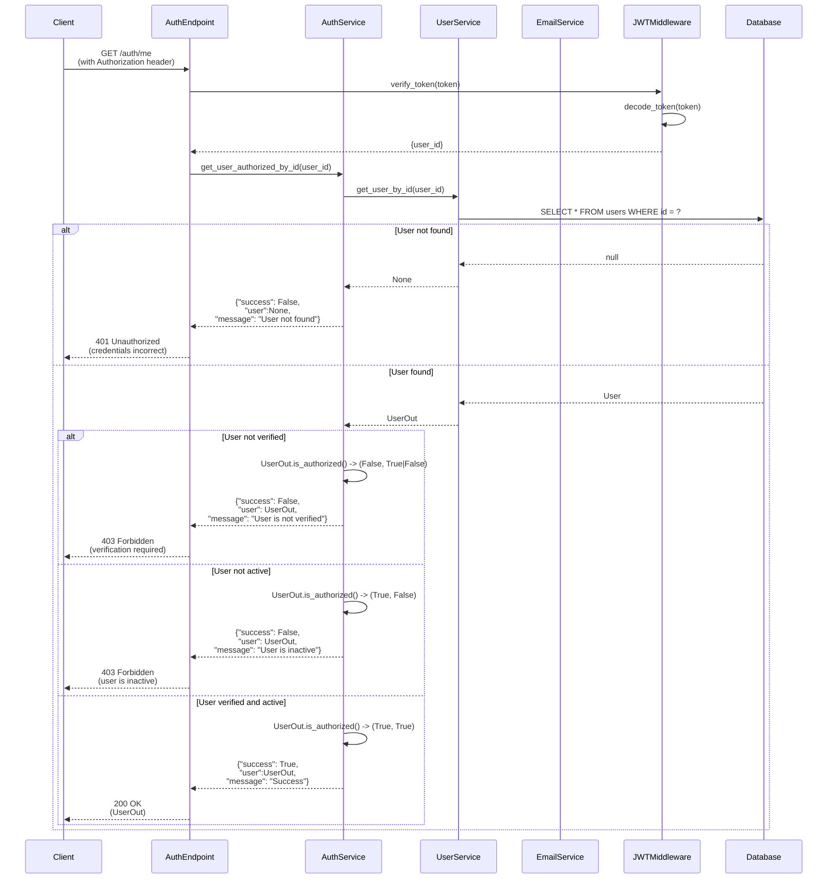
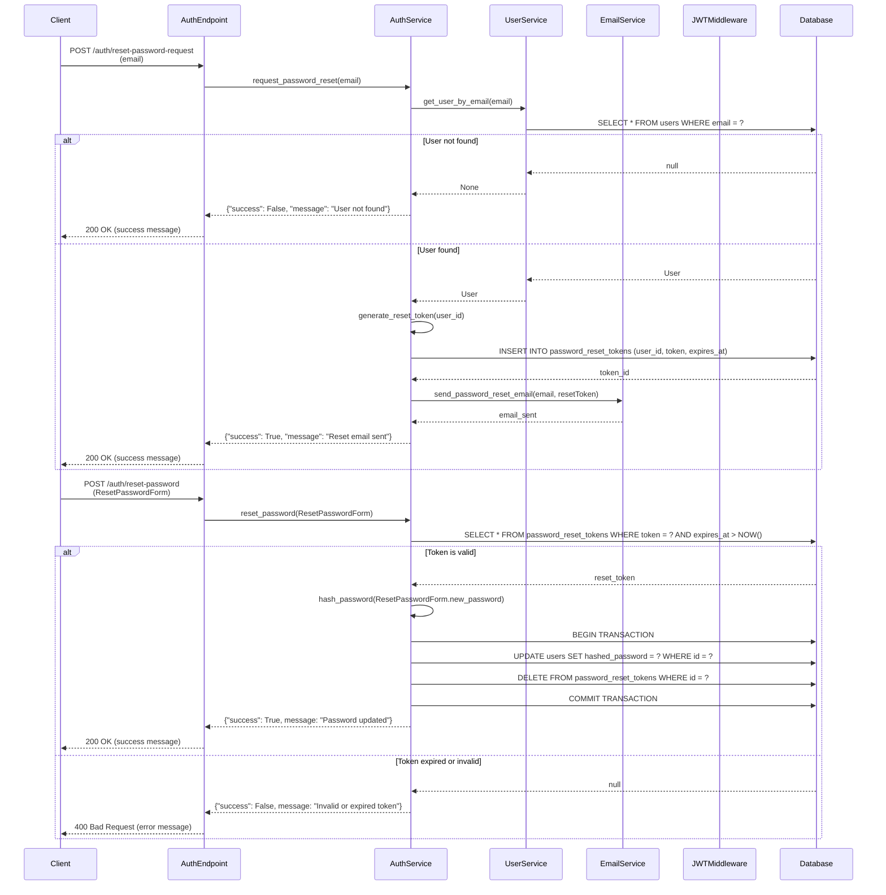

# E-Commerce API Sequence Diagrams

## User Registration and Verification

### Registration

### Verification

### Verification Resend

## User Authentication

### Login

### Authenticated Requests

## Reset Password

