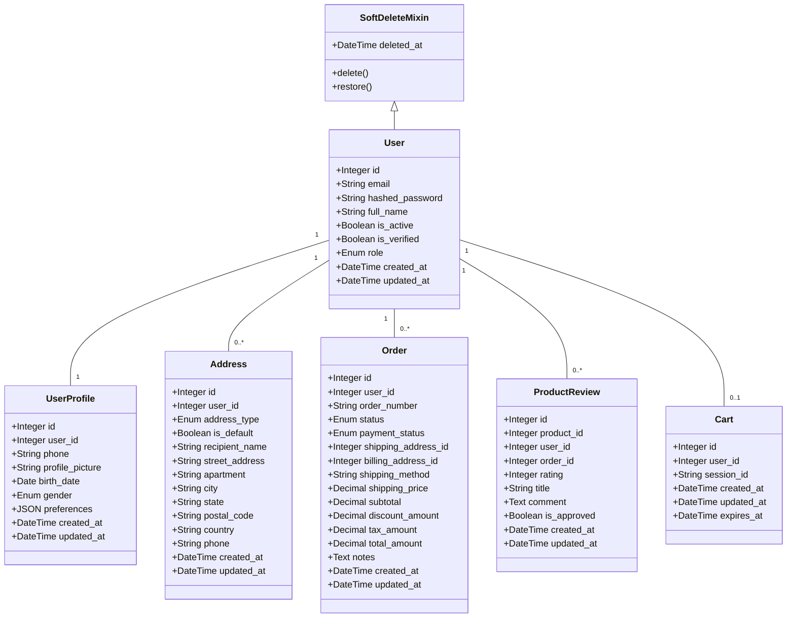
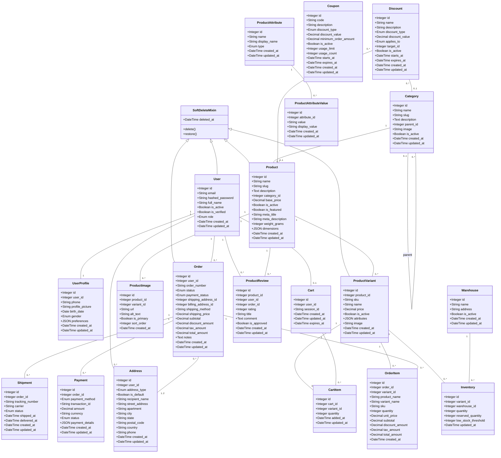

# UML Diagram for E-Commerce Platform

## Domain Models

### User Domain

```mermaid
classDiagram
    %% Base Class
    class SoftDeleteMixin {
        +DateTime deleted_at
        +delete()
        +restore()
    }
    
    %% User Domain
    class User {
        +Integer id
        +String email
        +String hashed_password
        +String full_name
        +Boolean is_active
        +Boolean is_verified
        +Enum role
        +DateTime created_at
        +DateTime updated_at
    }
    
    class UserProfile {
        +Integer id
        +Integer user_id
        +String phone
        +String profile_picture
        +Date birth_date
        +Enum gender
        +JSON preferences
        +DateTime created_at
        +DateTime updated_at
    }
    
    class Address {
        +Integer id
        +Integer user_id
        +Enum address_type
        +Boolean is_default
        +String recipient_name
        +String street_address
        +String apartment
        +String city
        +String state
        +String postal_code
        +String country
        +String phone
        +DateTime created_at
        +DateTime updated_at
    }
    
    %% Product Domain
    class ProductReview {
        +Integer id
        +Integer product_id
        +Integer user_id
        +Integer order_id
        +Integer rating
        +String title
        +Text comment
        +Boolean is_approved
        +DateTime created_at
        +DateTime updated_at
    }
    
    %% Cart Domain
    class Cart {
        +Integer id
        +Integer user_id
        +String session_id
        +DateTime created_at
        +DateTime updated_at
        +DateTime expires_at
    }
    
    %% Order Domain
    class Order {
        +Integer id
        +Integer user_id
        +String order_number
        +Enum status
        +Enum payment_status
        +Integer shipping_address_id
        +Integer billing_address_id
        +String shipping_method
        +Decimal shipping_price
        +Decimal subtotal
        +Decimal discount_amount
        +Decimal tax_amount
        +Decimal total_amount
        +Text notes
        +DateTime created_at
        +DateTime updated_at
    }
    
    %% Relationships
    SoftDeleteMixin <|-- User
    
    User "1" -- "1" UserProfile
    User "1" -- "0..*" Address
    User "1" -- "0..*" Order
    User "1" -- "0..*" ProductReview
    User "1" -- "0..1" Cart
```

### Product Domain

```mermaid
classDiagram
    %% Base Class
    class SoftDeleteMixin {
        +DateTime deleted_at
        +delete()
        +restore()
    }
    
    %% User Domain
    class User {
        +Integer id
        +String email
        +String hashed_password
        +String full_name
        +Boolean is_active
        +Boolean is_verified
        +Enum role
        +DateTime created_at
        +DateTime updated_at
    }
    
    class UserProfile {
        +Integer id
        +Integer user_id
        +String phone
        +String profile_picture
        +Date birth_date
        +Enum gender
        +JSON preferences
        +DateTime created_at
        +DateTime updated_at
    }
    
    class Address {
        +Integer id
        +Integer user_id
        +Enum address_type
        +Boolean is_default
        +String recipient_name
        +String street_address
        +String apartment
        +String city
        +String state
        +String postal_code
        +String country
        +String phone
        +DateTime created_at
        +DateTime updated_at
    }
    
    %% Product Domain
    class Category {
        +Integer id
        +String name
        +String slug
        +Text description
        +Integer parent_id
        +String image
        +Boolean is_active
        +DateTime created_at
        +DateTime updated_at
    }
    
    class Product {
        +Integer id
        +String name
        +String slug
        +Text description
        +Integer category_id
        +Decimal base_price
        +Boolean is_active
        +Boolean is_featured
        +String meta_title
        +String meta_description
        +Integer weight_grams
        +JSON dimensions
        +DateTime created_at
        +DateTime updated_at
    }
    
    class ProductVariant {
        +Integer id
        +Integer product_id
        +String sku
        +String name
        +Decimal price
        +Boolean is_active
        +JSON attributes
        +String image
        +DateTime created_at
        +DateTime updated_at
    }
    
    class ProductImage {
        +Integer id
        +Integer product_id
        +Integer variant_id
        +String url
        +String alt_text
        +Boolean is_primary
        +Integer sort_order
        +DateTime created_at
    }
    
    class ProductAttribute {
        +Integer id
        +String name
        +String display_name
        +Enum type
        +DateTime created_at
        +DateTime updated_at
    }
    
    class ProductAttributeValue {
        +Integer id
        +Integer attribute_id
        +String value
        +String display_value
        +DateTime created_at
        +DateTime updated_at
    }
    
    class Inventory {
        +Integer id
        +Integer variant_id
        +Integer warehouse_id
        +Integer quantity
        +Integer reserved_quantity
        +Integer low_stock_threshold
        +DateTime updated_at
    }
    
    class Warehouse {
        +Integer id
        +String name
        +String address
        +Boolean is_active
        +DateTime created_at
        +DateTime updated_at
    }
    
    class ProductReview {
        +Integer id
        +Integer product_id
        +Integer user_id
        +Integer order_id
        +Integer rating
        +String title
        +Text comment
        +Boolean is_approved
        +DateTime created_at
        +DateTime updated_at
    }
    
    %% Cart Domain
    class Cart {
        +Integer id
        +Integer user_id
        +String session_id
        +DateTime created_at
        +DateTime updated_at
        +DateTime expires_at
    }
    
    class CartItem {
        +Integer id
        +Integer cart_id
        +Integer variant_id
        +Integer quantity
        +DateTime added_at
        +DateTime updated_at
    }
    
    %% Order Domain
    class Order {
        +Integer id
        +Integer user_id
        +String order_number
        +Enum status
        +Enum payment_status
        +Integer shipping_address_id
        +Integer billing_address_id
        +String shipping_method
        +Decimal shipping_price
        +Decimal subtotal
        +Decimal discount_amount
        +Decimal tax_amount
        +Decimal total_amount
        +Text notes
        +DateTime created_at
        +DateTime updated_at
    }
    
    class OrderItem {
        +Integer id
        +Integer order_id
        +Integer variant_id
        +String product_name
        +String variant_name
        +String sku
        +Integer quantity
        +Decimal unit_price
        +Decimal subtotal
        +Decimal discount_amount
        +Decimal tax_amount
        +Decimal total_amount
        +DateTime created_at
    }
    
    class Payment {
        +Integer id
        +Integer order_id
        +Enum payment_method
        +String transaction_id
        +Decimal amount
        +String currency
        +Enum status
        +JSON payment_details
        +DateTime created_at
        +DateTime updated_at
    }
    
    class Shipment {
        +Integer id
        +Integer order_id
        +String tracking_number
        +String carrier
        +Enum status
        +DateTime shipped_at
        +DateTime delivered_at
        +DateTime created_at
        +DateTime updated_at
    }
    
    %% Promotion Domain
    class Coupon {
        +Integer id
        +String code
        +String description
        +Enum discount_type
        +Decimal discount_value
        +Decimal minimum_order_amount
        +Boolean is_active
        +Integer usage_limit
        +Integer usage_count
        +DateTime starts_at
        +DateTime expires_at
        +DateTime created_at
        +DateTime updated_at
    }
    
    class Discount {
        +Integer id
        +String name
        +String description
        +Enum discount_type
        +Decimal discount_value
        +Enum applies_to
        +Integer target_id
        +Boolean is_active
        +DateTime starts_at
        +DateTime expires_at
        +DateTime created_at
        +DateTime updated_at
    }
    
    %% Relationships
    SoftDeleteMixin <|-- Product
    SoftDeleteMixin <|-- ProductVariant
    SoftDeleteMixin <|-- User
    SoftDeleteMixin <|-- Order
    
    User "1" -- "1" UserProfile
    User "1" -- "0..*" Address
    User "1" -- "0..*" Order
    User "1" -- "0..*" ProductReview
    User "1" -- "0..1" Cart
    
    Category "0..1" -- "0..*" Category : parent
    Category "1" -- "0..*" Product
    
    Product "1" -- "0..*" ProductVariant
    Product "1" -- "0..*" ProductImage
    Product "1" -- "0..*" ProductReview
    
    ProductAttribute "1" -- "0..*" ProductAttributeValue
    
    ProductVariant "1" -- "0..*" CartItem
    ProductVariant "1" -- "0..*" OrderItem
    ProductVariant "1" -- "0..*" Inventory
    
    Warehouse "1" -- "0..*" Inventory
    
    Cart "1" -- "0..*" CartItem
    
    Order "1" -- "0..*" OrderItem
    Order "1" -- "0..*" Payment
    Order "1" -- "0..*" Shipment
    Order "0..*" -- "1..2" Address
    
    Discount "0..*" -- "0..1" Product
    Discount "0..*" -- "0..1" Category
```
