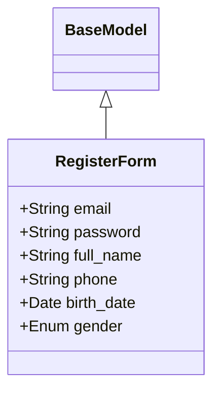
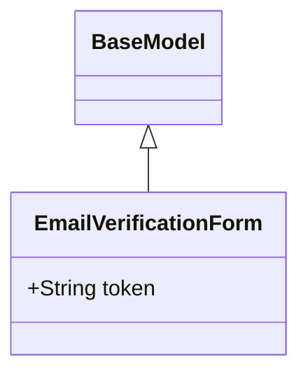
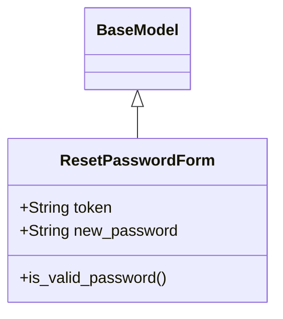

# UML Diagram for E-Commerce Platform Request Models

## Request Models

### RegisterForm

```mermaid
classDiagram
    class RegisterForm {
        +String email
        +String password
        +String full_name
        +String phone
        +Date birth_date
        +Enum gender
    }
    
    %% Relationships
    BaseModel <|-- RegisterForm
```

### EmailVerificationForm

```mermaid
classDiagram
    class EmailVerificationForm {
        +String token
    }
    
    %% Relationships
    BaseModel <|-- EmailVerificationForm
```

### ResetPasswordForm

```mermaid
classDiagram
    class ResetPasswordForm {
        +String token
        +String new_password
        +is_valid_password()
    } 
    
    %% Relationships
    BaseModel <|-- ResetPasswordForm
```