# E-Commerce Database ERD

```mermaid
erDiagram
    %% User Domain
    roles {
        int id PK
        varchar name
    }

    verification_tokens {
        int id PK
        int user_id FK
        varchar token
        timestamp expires_at
    }

    password_reset_tokens {
        int id PK
        int user_id FK
        varchar token
        timestamp expires_at
    }
    
    users {
        int id PK
        varchar email UK
        varchar hashed_password
        text full_name
        boolean is_active
        boolean is_verified
        int role FK
        timestamp created_at
        timestamp updated_at
        timestamp deleted_at "defaults to NULL"
    }
    
    gender {
        ENUM values
        string MALE
        string FEMALE
        string OTHER
        string PREFER_NOT_TO_SAY
    }

    user_profiles {
        int id PK
        int user_id FK
        varchar phone "defaults to NULL"
        date birth_date "defaults to NULL"
        enum gender "defaults to NULL"
        jsonb preferences "defaults to NULL"
        timestamp created_at
        timestamp updated_at
    }
    
    address_type {
        ENUM values
        string BILLING
        string SHIPPING
    }
    
    addresses {
        int id PK
        int user_id FK
        enum address_type
        boolean is_default
        text recipient_name
        varchar street_address
        varchar complement "defaults to NULL"
        varchar city
        varchar state
        varchar postal_code
        varchar country
        varchar phone
        timestamp created_at
        timestamp updated_at
    }
    
    %% Product Domain
    categories {
        int id PK
        varchar name
        varchar slug UK
        text description "defaults to NULL"
        int parent_id FK "defaults to NULL"
        text image "defaults to NULL"
        boolean is_active
        timestamp created_at
        timestamp updated_at
    }
    
    products {
        int id PK
        varchar name
        varchar slug UK
        text description
        int category_id FK
        decimal base_price
        boolean is_active
        boolean is_featured
        varchar meta_title "defaults to NULL"
        varchar meta_description "defaults to NULL"
        int weight_grams "defaults to NULL"
        jsonb dimensions "defaults to NULL"
        timestamp created_at
        timestamp updated_at
        timestamp deleted_at "defaults to NULL"
    }
    
    product_variants {
        int id PK
        int product_id FK
        varchar sku UK
        varchar name
        decimal price
        boolean is_active
        jsonb attributes
        text image "defaults to NULL"
        timestamp created_at
        timestamp updated_at
        timestamp deleted_at "defaults to NULL"
    }
    
    product_images {
        int id PK
        int product_id FK
        int variant_id FK "defaults to NULL"
        text url
        varchar alt_text "defaults to NULL"
        boolean is_primary
        int sort_order
        timestamp created_at
    }
    
    attribute_type {
        ENUM values
        string TEXT
        string NUMBER
        string BOOLEAN
    }

    product_attributes {
        int id PK
        varchar name
        varchar display_name
        enum attribute_type
        timestamp created_at
        timestamp updated_at
    }
    
    product_attribute_values {
        int id PK
        int attribute_id FK
        varchar value
        varchar display_value
        timestamp created_at
        timestamp updated_at
    }
    
    inventories {
        int id PK
        int variant_id FK
        int warehouse_id FK
        int quantity
        int reserved_quantity
        int low_stock_threshold "defaults to NULL"
        timestamp updated_at
    }
    
    warehouses {
        int id PK
        varchar name
        boolean is_active
        varchar street_address
        varchar complement "defaults to NULL"
        varchar city
        varchar state
        varchar postal_code
        varchar country
        varchar phone
        timestamp created_at
        timestamp updated_at
    }

    product_reviews {
        int id PK
        int product_id FK
        int user_id FK
        int order_id FK "defaults to NULL"
        int rating
        varchar title "defaults to NULL"
        text comment "defaults to NULL"
        boolean is_approved
        timestamp created_at
        timestamp updated_at
    }
    
    %% Cart Domain
    carts {
        int id PK
        int user_id FK "defaults to NULL"
        varchar session_id
        timestamp created_at
        timestamp updated_at
        timestamp expires_at "defaults to NULL"
    }
    
    cart_items {
        int id PK
        int cart_id FK
        int variant_id FK
        int quantity
        timestamp added_at
        timestamp updated_at
    }
    
    %% Order Domain
    order_status {
        ENUM values
        string PENDING
        string PROCESSING
        string SHIPPED
        string DELIVERED
        string CANCELLED
    }
    
    payment_status {
        ENUM values
        string PENDING
        string PAID
        string COMPLETED
        string FAILED
        string REFUNDED
    }
    
    orders {
        int id PK
        int user_id FK "defaults to NULL"
        varchar order_number UK
        enum order_status
        enum payment_status
        int shipping_address_id FK
        int billing_address_id FK
        varchar shipping_method
        decimal shipping_price
        decimal subtotal
        decimal discount_amount
        decimal tax_amount
        decimal total_amount
        text notes "defaults to NULL"
        timestamp created_at
        timestamp updated_at
        timestamp deleted_at "defaults to NULL"
    }
    
    order_items {
        int id PK
        int order_id FK
        int variant_id FK
        varchar product_name
        varchar variant_name
        varchar sku
        int quantity
        decimal unit_price
        decimal subtotal
        decimal discount_amount
        decimal tax_amount
        decimal total_amount
        timestamp created_at
    }
    
    payment_method {
        ENUM values
        string CREDIT_CARD
        string PAYPAL
        string STRIPE
        string BANK_TRANSFER
        string CASH_ON_DELIVERY
    }

    payments {
        int id PK
        int order_id FK
        enum payment_method
        varchar transaction_id
        decimal amount
        varchar currency
        enum payment_status
        jsonb payment_details
        timestamp created_at
        timestamp updated_at
    }
    
    shipment_status {
        ENUM values
        string PROCESSING
        string SHIPPED
        string IN_TRANSIT
        string OUT_FOR_DELIVERY
        string ADDRESS_NOT_FOUND
        string RECEIVER_NOT_FOUND_AT_DESTINATION
        string DELIVERED
    }

    shipments {
        int id PK
        int order_id FK
        varchar tracking_number "defaults to NULL"
        varchar carrier
        enum shipment_status
        timestamp shipped_at "defaults to NULL"
        timestamp delivered_at "defaults to NULL"
        timestamp created_at
        timestamp updated_at
    }
    
    %% Promotion Domain
    coupons {
        int id PK
        varchar code UK
        varchar description
        enum discount_type
        decimal discount_value
        decimal minimum_order_amount "defaults to NULL"
        boolean is_active
        int usage_limit "defaults to NULL"
        int usage_count
        timestamp starts_at
        timestamp expires_at "defaults to NULL"
        timestamp created_at
        timestamp updated_at
    }
    
    discount_type {
        ENUM values
        string PERCENTAGE
        string FIXED_AMOUNT
    }

    applies_to {
        ENUM values
        string PRODUCT
        string CATEGORY
        string CART
    }
    
    discounts {
        int id PK
        varchar name
        varchar description
        enum discount_type
        decimal discount_value
        enum applies_to
        int target_id "defaults to NULL"
        boolean is_active
        timestamp starts_at
        timestamp expires_at "defaults to NULL"
        timestamp created_at
        timestamp updated_at
    }
    
    %% Relationships
    users ||--o| verification_tokens : "has"
    users ||--o| password_reset_tokens : "has"
    users ||--o{ roles : "has"
    users ||--o{ user_profiles : "has"
    users ||--o{ addresses : "has"
    users ||--o{ orders : "places"
    users ||--o{ product_reviews : "writes"
    users ||--o{ carts : "has"

    roles ||--o{ users : "has"
    
    categories ||--o{ categories : "parent_of"
    categories ||--o{ products : "contains"
    
    products ||--o{ product_variants : "has"
    products ||--o{ product_images : "has"
    products ||--o{ product_reviews : "receives"
    
    product_attributes ||--o{ product_attribute_values : "has"
    
    product_variants ||--o{ cart_items : "added_to"
    product_variants ||--o{ order_items : "ordered_as"
    product_variants ||--o{ inventories : "stocked_as"
    product_variants ||--o{ product_images : "displayed_in"
    
    warehouses ||--o{ inventories : "stocks"
    
    carts ||--o{ cart_items : "contains"
    
    orders ||--o{ order_items : "includes"
    orders ||--o{ payments : "receives"
    orders ||--o{ shipments : "fulfilled_by"
    orders }o--|| addresses : "ships_to"
    orders }o--|| addresses : "bills_to"
    
    discounts }o--o{ products : "applies_to"
    discounts }o--o{ categories : "applies_to"
```

## Table Structures

### User Domain

#### User

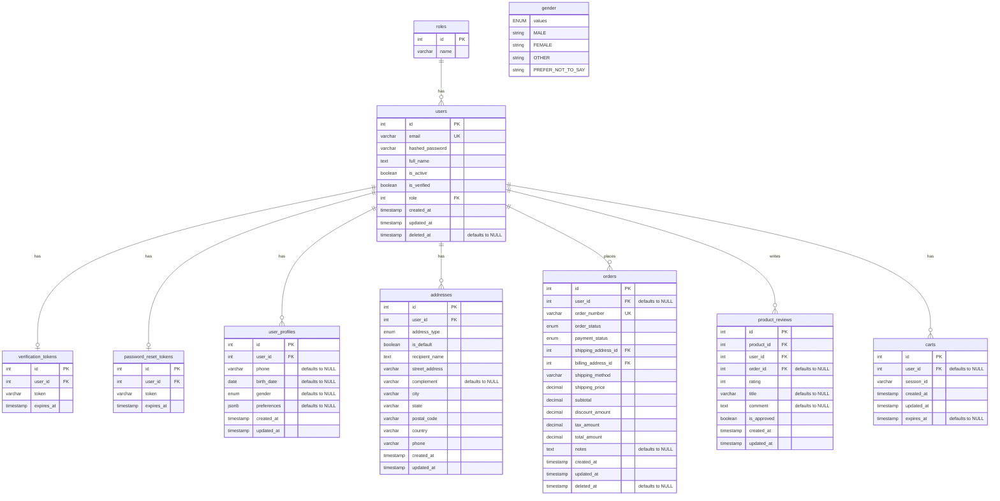
```mermaid
erDiagram
    roles {
        int id PK
        varchar name
    }
    
    verification_tokens {
        int id PK
        int user_id FK
        varchar token
        timestamp expires_at
    }

    password_reset_tokens {
        int id PK
        int user_id FK
        varchar token
        timestamp expires_at
    }
    
    users {
        int id PK
        varchar email UK
        varchar hashed_password
        text full_name
        boolean is_active
        boolean is_verified
        int role FK
        timestamp created_at
        timestamp updated_at
        timestamp deleted_at "defaults to NULL"
    }
    
    gender {
        ENUM values
        string MALE
        string FEMALE
        string OTHER
        string PREFER_NOT_TO_SAY
    }

    user_profiles {
        int id PK
        int user_id FK
        varchar phone "defaults to NULL"
        date birth_date "defaults to NULL"
        enum gender "defaults to NULL"
        jsonb preferences "defaults to NULL"
        timestamp created_at
        timestamp updated_at
    }
    
    addresses {
        int id PK
        int user_id FK
        enum address_type
        boolean is_default
        text recipient_name
        varchar street_address
        varchar complement "defaults to NULL"
        varchar city
        varchar state
        varchar postal_code
        varchar country
        varchar phone
        timestamp created_at
        timestamp updated_at
    }

    product_reviews {
        int id PK
        int product_id FK
        int user_id FK
        int order_id FK "defaults to NULL"
        int rating
        varchar title "defaults to NULL"
        text comment "defaults to NULL"
        boolean is_approved
        timestamp created_at
        timestamp updated_at
    }

    orders {
        int id PK
        int user_id FK "defaults to NULL"
        varchar order_number UK
        enum order_status
        enum payment_status
        int shipping_address_id FK
        int billing_address_id FK
        varchar shipping_method
        decimal shipping_price
        decimal subtotal
        decimal discount_amount
        decimal tax_amount
        decimal total_amount
        text notes "defaults to NULL"
        timestamp created_at
        timestamp updated_at
        timestamp deleted_at "defaults to NULL"
    }
    
    %% Cart Domain
    carts {
        int id PK
        int user_id FK "defaults to NULL"
        varchar session_id
        timestamp created_at
        timestamp updated_at
        timestamp expires_at "defaults to NULL"
    }

    %% Relationships
    users ||--o| verification_tokens : "has"
    users ||--o| password_reset_tokens : "has"
    users ||--o{ user_profiles : "has"
    users ||--o{ addresses : "has"
    users ||--o{ orders : "places"
    users ||--o{ product_reviews : "writes"
    users ||--o{ carts : "has"

    roles ||--o{ users : "has"
```

#### UserProfile

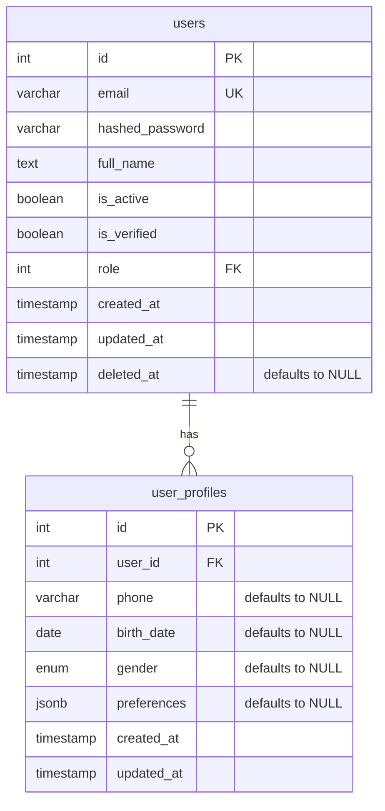
```mermaid
erDiagram
    %% User Domain
    users {
        int id PK
        varchar email UK
        varchar hashed_password
        text full_name
        boolean is_active
        boolean is_verified
        int role FK
        timestamp created_at
        timestamp updated_at
        timestamp deleted_at "defaults to NULL"
    }
    
    user_profiles {
        int id PK
        int user_id FK
        varchar phone "defaults to NULL"
        date birth_date "defaults to NULL"
        enum gender "defaults to NULL"
        jsonb preferences "defaults to NULL"
        timestamp created_at
        timestamp updated_at
    }

    users ||--o{ user_profiles : "has"
```

#### Address

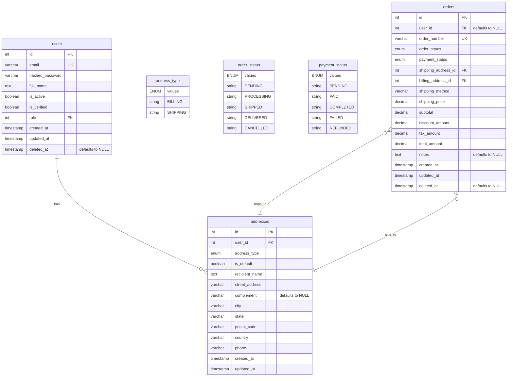
```mermaid
erDiagram
    %% User Domain
    users {
        int id PK
        varchar email UK
        varchar hashed_password
        text full_name
        boolean is_active
        boolean is_verified
        int role FK
        timestamp created_at
        timestamp updated_at
        timestamp deleted_at "defaults to NULL"
    }
    
    address_type {
        ENUM values
        string BILLING
        string SHIPPING
    }
    
    addresses {
        int id PK
        int user_id FK
        enum address_type
        boolean is_default
        text recipient_name
        varchar street_address
        varchar complement "defaults to NULL"
        varchar city
        varchar state
        varchar postal_code
        varchar country
        varchar phone
        timestamp created_at
        timestamp updated_at
    }
    
    %% Order Domain
    order_status {
        ENUM values
        string PENDING
        string PROCESSING
        string SHIPPED
        string DELIVERED
        string CANCELLED
    }
    
    payment_status {
        ENUM values
        string PENDING
        string PAID
        string COMPLETED
        string FAILED
        string REFUNDED
    }
    
    orders {
        int id PK
        int user_id FK "defaults to NULL"
        varchar order_number UK
        enum order_status
        enum payment_status
        int shipping_address_id FK
        int billing_address_id FK
        varchar shipping_method
        decimal shipping_price
        decimal subtotal
        decimal discount_amount
        decimal tax_amount
        decimal total_amount
        text notes "defaults to NULL"
        timestamp created_at
        timestamp updated_at
        timestamp deleted_at "defaults to NULL"
    }
    
    %% Relationships
    users ||--o{ addresses : "has"
    orders }o--|| addresses : "ships_to"
    orders }o--|| addresses : "bills_to"
```

#### roles
- `id`: integer PK (Primary Key) (**Unique identifier for each role**)
- `name`: varchar(50) (**Name of the role**)

#### verification_tokens
- `id`: integer PK (Primary Key) (**Unique identifier for each verification token**)
- `user_id`: integer FK (**Reference to the user who owns the token**)
- `token`: varchar(255) (**Unique token for verification**)
- `expires_at`: timestamp

#### password_reset_tokens
- `id`: integer PK (Primary Key) (**Unique identifier for each password reset token**)
- `user_id`: integer FK (**Reference to the user who owns the token**)
- `token`: varchar(255) (**Unique token for password reset**)
- `expires_at`: timestamp

#### users
- `id`: integer PK (Primary Key) (**Unique identifier for each user**)
- `email`: varchar(255) UK (Unique Key) (**User's email address, used for login and communication that must follow *RFC 5321 maximum length***)
- `hashed_password`: varchar(255) (**Securely stored password hash**)
- `full_name`: text (**User's complete name**)
- `is_active`: boolean (**Flag indicating if the account is active or disabled**)
- `is_verified`: boolean (**Flag indicating if the email has been verified**)
- `role`: integer FK -> roles.id (**Reference to the user's role, determining permissions**)
- `created_at`: timestamp
- `updated_at`: timestamp
- `deleted_at`: timestamp NULL (for soft delete)

#### user_profiles
- `id`: integer PK (**Unique identifier for each profile**)
- `user_id`: integer FK (Foreign Key) -> users.id (**Reference to the associated user**)
- `phone`: varchar(20) NULL (**User's contact phone number**)
- `birth_date`: date NULL (**User's date of birth for age verification and birthday offers**)
- `gender`: enum ('MALE', 'FEMALE', 'OTHER', 'PREFER_NOT_TO_SAY') NULL (**User's gender identity**)
- `preferences`: jsonb NULL (**JSON containing user preferences (e.g., notification settings, theme)**)
- `created_at`: timestamp
- `updated_at`: timestamp

#### addresses
- `id`: integer PK (**Unique identifier for each address**)
- `user_id`: integer FK -> users.id (**Reference to the associated user**)
- `address_type`: enum ('BILLING', 'SHIPPING') (**Indicates if this is a billing or shipping address**)
- `is_default`: boolean (**Flag indicating if this is the user's default address**)
- `recipient_name`: text (**Name of the person receiving packages which may differ from user's name**)
- `street_address`: varchar(250) (**Primary street address line**)
- `complement`: varchar(50) NULL (**Additional address details (apartment, suite, unit)**)
- `city`: varchar(100) (**City/town name**)
- `state`: varchar(100) (**State/province/region**)
- `postal_code`: varchar(20) (**ZIP or postal code**)
- `country`: varchar(80) (**Country name**)
- `phone`: varchar(20) (**Contact phone for delivery questions**)
- `created_at`: timestamp
- `updated_at`: timestamp

### Product Domain

#### Category

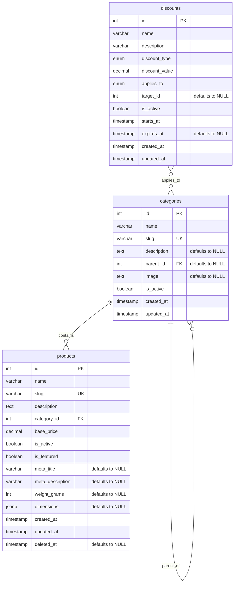
```mermaid
erDiagram
    %% Product Domain
    categories {
        int id PK
        varchar name
        varchar slug UK
        text description "defaults to NULL"
        int parent_id FK "defaults to NULL"
        text image "defaults to NULL"
        boolean is_active
        timestamp created_at
        timestamp updated_at
    }
    
    products {
        int id PK
        varchar name
        varchar slug UK
        text description
        int category_id FK
        decimal base_price
        boolean is_active
        boolean is_featured
        varchar meta_title "defaults to NULL"
        varchar meta_description "defaults to NULL"
        int weight_grams "defaults to NULL"
        jsonb dimensions "defaults to NULL"
        timestamp created_at
        timestamp updated_at
        timestamp deleted_at "defaults to NULL"
    }
    
    %% Promotion Domain
    discounts {
        int id PK
        varchar name
        varchar description
        enum discount_type
        decimal discount_value
        enum applies_to
        int target_id "defaults to NULL"
        boolean is_active
        timestamp starts_at
        timestamp expires_at "defaults to NULL"
        timestamp created_at
        timestamp updated_at
    }
    
    %% Relationships
    categories ||--o{ categories : "parent_of"
    categories ||--o{ products : "contains"
    discounts }o--o{ categories : "applies_to"
```

#### Product

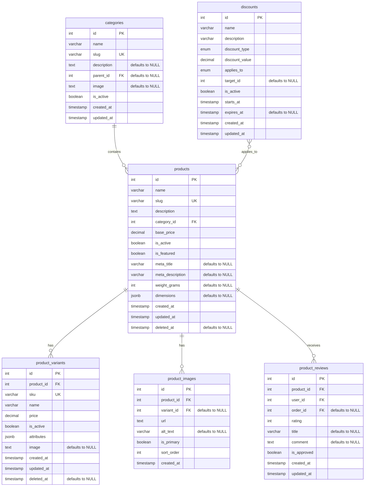
```mermaid
erDiagram
    %% Product Domain
    categories {
        int id PK
        varchar name
        varchar slug UK
        text description "defaults to NULL"
        int parent_id FK "defaults to NULL"
        text image "defaults to NULL"
        boolean is_active
        timestamp created_at
        timestamp updated_at
    }
    
    products {
        int id PK
        varchar name
        varchar slug UK
        text description
        int category_id FK
        decimal base_price
        boolean is_active
        boolean is_featured
        varchar meta_title "defaults to NULL"
        varchar meta_description "defaults to NULL"
        int weight_grams "defaults to NULL"
        jsonb dimensions "defaults to NULL"
        timestamp created_at
        timestamp updated_at
        timestamp deleted_at "defaults to NULL"
    }
    
    product_variants {
        int id PK
        int product_id FK
        varchar sku UK
        varchar name
        decimal price
        boolean is_active
        jsonb attributes
        text image "defaults to NULL"
        timestamp created_at
        timestamp updated_at
        timestamp deleted_at "defaults to NULL"
    }
    
    product_images {
        int id PK
        int product_id FK
        int variant_id FK "defaults to NULL"
        text url
        varchar alt_text "defaults to NULL"
        boolean is_primary
        int sort_order
        timestamp created_at
    }
    
    product_reviews {
        int id PK
        int product_id FK
        int user_id FK
        int order_id FK "defaults to NULL"
        int rating
        varchar title "defaults to NULL"
        text comment "defaults to NULL"
        boolean is_approved
        timestamp created_at
        timestamp updated_at
    }
    
    %% Promotion Domain
    discounts {
        int id PK
        varchar name
        varchar description
        enum discount_type
        decimal discount_value
        enum applies_to
        int target_id "defaults to NULL"
        boolean is_active
        timestamp starts_at
        timestamp expires_at "defaults to NULL"
        timestamp created_at
        timestamp updated_at
    }
    
    %% Relationships
    categories ||--o{ products : "contains"
    
    products ||--o{ product_variants : "has"
    products ||--o{ product_images : "has"
    products ||--o{ product_reviews : "receives"
    discounts }o--o{ products : "applies_to"
```

#### ProductVariant

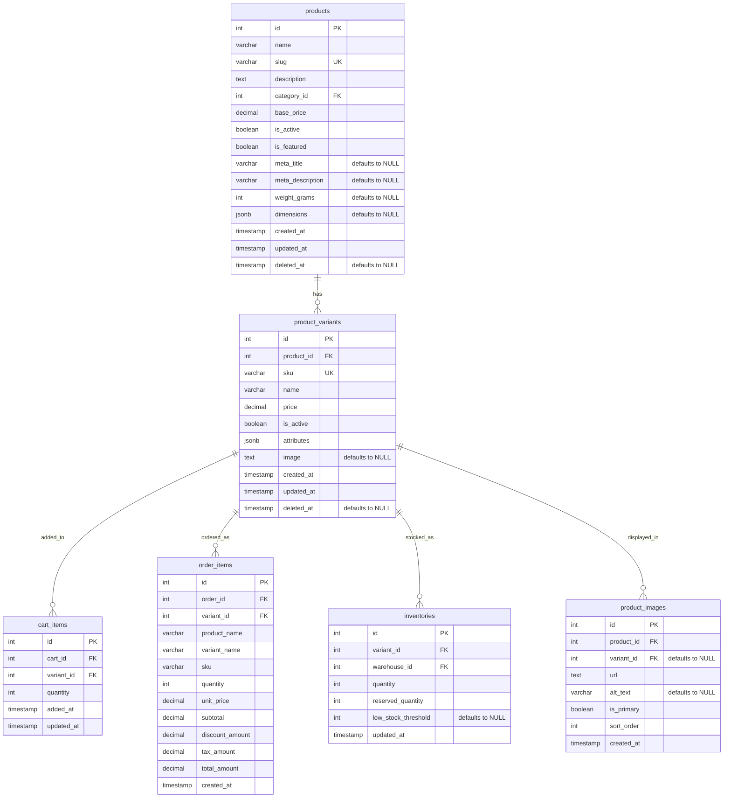
```mermaid
erDiagram
    products {
        int id PK
        varchar name
        varchar slug UK
        text description
        int category_id FK
        decimal base_price
        boolean is_active
        boolean is_featured
        varchar meta_title "defaults to NULL"
        varchar meta_description "defaults to NULL"
        int weight_grams "defaults to NULL"
        jsonb dimensions "defaults to NULL"
        timestamp created_at
        timestamp updated_at
        timestamp deleted_at "defaults to NULL"
    }
    
    product_variants {
        int id PK
        int product_id FK
        varchar sku UK
        varchar name
        decimal price
        boolean is_active
        jsonb attributes
        text image "defaults to NULL"
        timestamp created_at
        timestamp updated_at
        timestamp deleted_at "defaults to NULL"
    }

    product_images {
        int id PK
        int product_id FK
        int variant_id FK "defaults to NULL"
        text url
        varchar alt_text "defaults to NULL"
        boolean is_primary
        int sort_order
        timestamp created_at
    }
        
    inventories {
        int id PK
        int variant_id FK
        int warehouse_id FK
        int quantity
        int reserved_quantity
        int low_stock_threshold "defaults to NULL"
        timestamp updated_at
    }
    
    %% Cart Domain
    cart_items {
        int id PK
        int cart_id FK
        int variant_id FK
        int quantity
        timestamp added_at
        timestamp updated_at
    }
    
    %% Order Domain
    order_items {
        int id PK
        int order_id FK
        int variant_id FK
        varchar product_name
        varchar variant_name
        varchar sku
        int quantity
        decimal unit_price
        decimal subtotal
        decimal discount_amount
        decimal tax_amount
        decimal total_amount
        timestamp created_at
    }
    
    %% Relationships
    products ||--o{ product_variants : "has"
    product_variants ||--o{ cart_items : "added_to"
    product_variants ||--o{ order_items : "ordered_as"
    product_variants ||--o{ inventories : "stocked_as"
    product_variants ||--o{ product_images : "displayed_in"
```

#### ProductImage

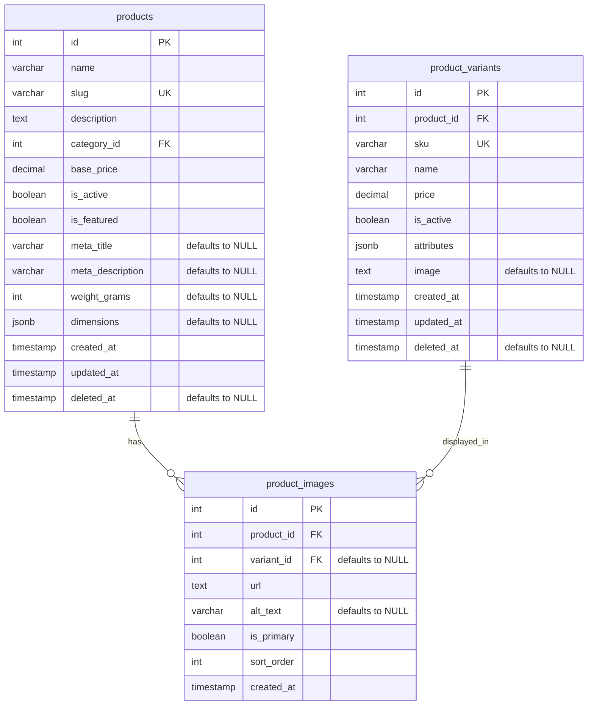
```mermaid
erDiagram
    products {
        int id PK
        varchar name
        varchar slug UK
        text description
        int category_id FK
        decimal base_price
        boolean is_active
        boolean is_featured
        varchar meta_title "defaults to NULL"
        varchar meta_description "defaults to NULL"
        int weight_grams "defaults to NULL"
        jsonb dimensions "defaults to NULL"
        timestamp created_at
        timestamp updated_at
        timestamp deleted_at "defaults to NULL"
    }
    
    product_variants {
        int id PK
        int product_id FK
        varchar sku UK
        varchar name
        decimal price
        boolean is_active
        jsonb attributes
        text image "defaults to NULL"
        timestamp created_at
        timestamp updated_at
        timestamp deleted_at "defaults to NULL"
    }

    product_images {
        int id PK
        int product_id FK
        int variant_id FK "defaults to NULL"
        text url
        varchar alt_text "defaults to NULL"
        boolean is_primary
        int sort_order
        timestamp created_at
    }
    
    %% Relationships
    products ||--o{ product_images : "has"
    product_variants ||--o{ product_images : "displayed_in"
```

#### ProductAttribute and ProductAttributeValue

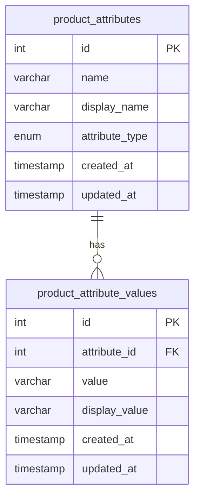
```mermaid
erDiagram
    product_attributes {
        int id PK
        varchar name
        varchar display_name
        enum attribute_type
        timestamp created_at
        timestamp updated_at
    }
    
    product_attribute_values {
        int id PK
        int attribute_id FK
        varchar value
        varchar display_value
        timestamp created_at
        timestamp updated_at
    }
    
    %% Relationships
    product_attributes ||--o{ product_attribute_values : "has"
```

#### Inventory and Warehouse

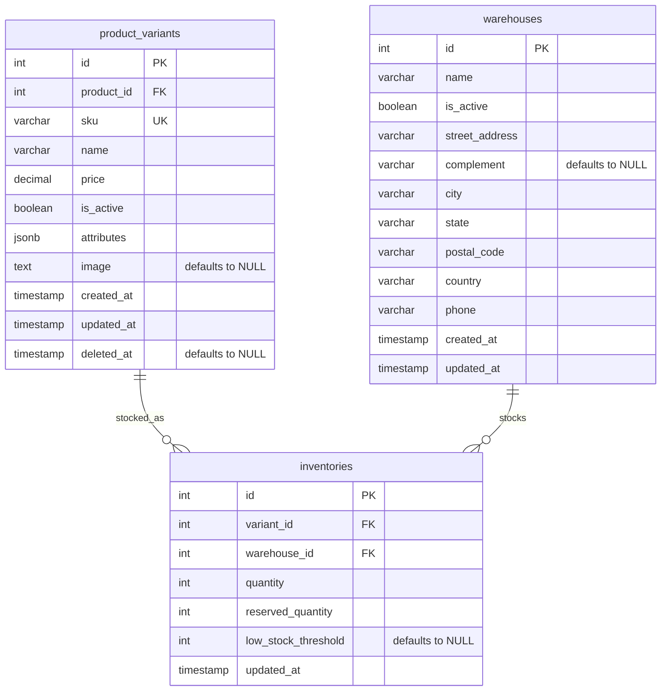
```mermaid
erDiagram
    %% Product Domain
    product_variants {
        int id PK
        int product_id FK
        varchar sku UK
        varchar name
        decimal price
        boolean is_active
        jsonb attributes
        text image "defaults to NULL"
        timestamp created_at
        timestamp updated_at
        timestamp deleted_at "defaults to NULL"
    }
    
    inventories {
        int id PK
        int variant_id FK
        int warehouse_id FK
        int quantity
        int reserved_quantity
        int low_stock_threshold "defaults to NULL"
        timestamp updated_at
    }
    
    warehouses {
        int id PK
        varchar name
        boolean is_active
        varchar street_address
        varchar complement "defaults to NULL"
        varchar city
        varchar state
        varchar postal_code
        varchar country
        varchar phone
        timestamp created_at
        timestamp updated_at
    }
    
    %% Relationships
    product_variants ||--o{ inventories : "stocked_as"
    warehouses ||--o{ inventories : "stocks"
```

#### ProductReview

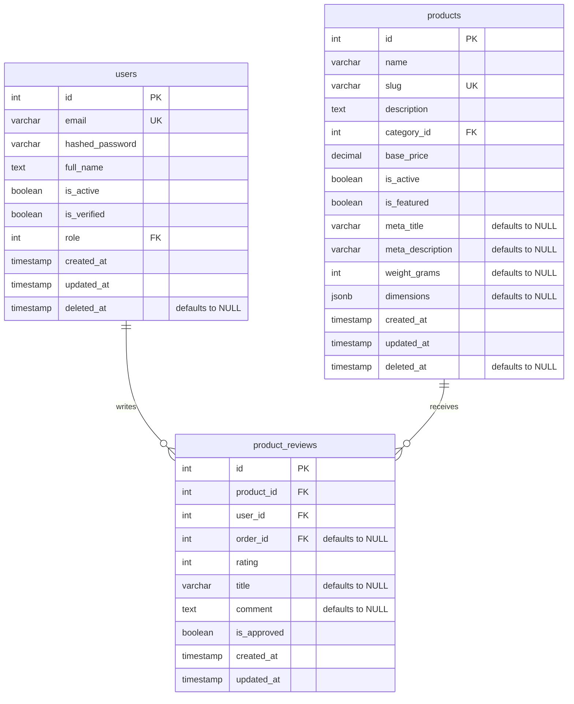
```mermaid
erDiagram
    %% User Domain
    users {
        int id PK
        varchar email UK
        varchar hashed_password
        text full_name
        boolean is_active
        boolean is_verified
        int role FK
        timestamp created_at
        timestamp updated_at
        timestamp deleted_at "defaults to NULL"
    }
    
    products {
        int id PK
        varchar name
        varchar slug UK
        text description
        int category_id FK
        decimal base_price
        boolean is_active
        boolean is_featured
        varchar meta_title "defaults to NULL"
        varchar meta_description "defaults to NULL"
        int weight_grams "defaults to NULL"
        jsonb dimensions "defaults to NULL"
        timestamp created_at
        timestamp updated_at
        timestamp deleted_at "defaults to NULL"
    }
    
    product_reviews {
        int id PK
        int product_id FK
        int user_id FK
        int order_id FK "defaults to NULL"
        int rating
        varchar title "defaults to NULL"
        text comment "defaults to NULL"
        boolean is_approved
        timestamp created_at
        timestamp updated_at
    }
    
    %% Relationships
    users ||--o{ product_reviews : "writes"
    products ||--o{ product_reviews : "receives"
```

#### categories
- `id`: integer PK (**Unique identifier for each category**)
- `name`: varchar(100) (**Display name of the category**)
- `slug`: varchar(150) UK (**URL-friendly version of the name for SEO**)
- `description`: text NULL (**Description of the category**)
- `parent_id`: integer FK -> categories.id NULL (self-reference) (**Reference to parent category (for hierarchical categorization)**)
- `image`: text NULL (**URL or path to category image**)
- `is_active`: boolean (**Flag indicating if the category is visible to users**)
- `created_at`: timestamp
- `updated_at`: timestamp

#### products
- `id`: integer PK (**Unique identifier for each product**)
- `name`: varchar(150) (**Product name displayed to customers**)
- `slug`: varchar(200) UK (**URL-friendly version of the name for SEO**)
- `description`: text (**Detailed product description**)
- `category_id`: integer FK -> categories.id (**Reference to the product's primary category**)
- `base_price`: decimal(10,2) (**Default price before variant-specific pricing**)
- `is_active`: boolean (**Flag indicating if the product is visible to users**)
- `is_featured`: boolean (**Flag indicating if the product should be featured in promotions**)
- `meta_title`: varchar(100) NULL (**SEO title tag content**)
- `meta_description`: varchar(255) NULL (**SEO meta description content**)
- `weight_grams`: integer NULL (**Product weight in grams for shipping calculations**)
- `dimensions`: jsonb NULL (**JSON containing product dimensions (length, width, height)**)
- `created_at`: timestamp
- `updated_at`: timestamp
- `deleted_at`: timestamp NULL (for soft delete)

#### product_variants
- `id`: integer PK (**Unique identifier for each product variant**)
- `product_id`: integer FK -> products.id (**Reference to the parent product**)
- `sku`: varchar(50) UK (**Stock Keeping Unit code for inventory tracking**)
- `name`: varchar(150) (**Variant name (e.g., "Blue, Large")**)
- `price`: decimal(10,2) (**Specific price for this variant**)
- `is_active`: boolean (**Flag indicating if this variant is available for purchase**)
- `attributes`: jsonb (**JSON containing variant attributes (color, size, etc.)**)
- `image`: text NULL (**URL or path to variant-specific image**)
- `created_at`: timestamp
- `updated_at`: timestamp
- `deleted_at`: timestamp NULL (for soft delete)

#### product_images
- `id`: integer PK (**Unique identifier for each image**)
- `product_id`: integer FK -> products.id (**Reference to the associated product**)
- `variant_id`: integer FK -> product_variants.id NULL (**Optional reference to a specific variant**)
- `url`: text (**URL or path to the image file**)
- `alt_text`: varchar(200) NULL (**Alternative text for accessibility and SEO**)
- `is_primary`: boolean (**Flag indicating if this is the main product image**)
- `sort_order`: integer (**Integer determining display order of multiple images**)
- `created_at`: timestamp

#### product_attributes
- `id`: integer PK (**Unique identifier for each attribute**)
- `name`: varchar(50) (**Attribute identifier (e.g., "color", "size", "material")**)
- `display_name`: varchar(100) (**User-friendly name to display**)
- `attribute_type`: enum ('STRING', 'NUMBER', 'BOOLEAN') (**Data type of the attribute**)
- `created_at`: timestamp
- `updated_at`: timestamp

#### product_attribute_values
- `id`: integer PK (**Unique identifier for each attribute value**)
- `attribute_id`: integer FK -> product_attributes.id (**Reference to the associated attribute**)
- `value`: varchar(100) (**Internal representation of the value**)
- `display_value`: varchar(150) (**User-friendly representation to display**)
- `created_at`: timestamp
- `updated_at`: timestamp

#### inventories
- `id`: integer PK (**Unique identifier for each inventory record**)
- `variant_id`: integer FK -> product_variants.id (**Reference to the product variant**)
- `warehouse_id`: integer FK -> warehouses.id (**Reference to the warehouse location**)
- `quantity`: integer (**Current available quantity in stock**)
- `reserved_quantity`: integer (**Quantity reserved for pending orders**)
- `low_stock_threshold`: integer NULL (**Level at which to trigger low stock alerts**)
- `updated_at`: timestamp

#### warehouses
- `id`: integer PK (**Unique identifier for each warehouse**)
- `name`: varchar(100) (**Name or identifier of the warehouse**)
- `street_address`: varchar(250)
- `complement`: varchar(50) NULL
- `city`: varchar(100)
- `state`: varchar(100)
- `postal_code`: varchar(20)
- `country`: varchar(80)
- `phone`: varchar(20)
- `is_active`: boolean (**Flag indicating if the warehouse is operational**)
- `created_at`: timestamp
- `updated_at`: timestamp

#### product_reviews
- `id`: integer PK (**Unique identifier for each review**)
- `product_id`: integer FK -> products.id (**Reference to the reviewed product**)
- `user_id`: integer FK -> users.id (**Reference to the user who wrote the review**)
- `order_id`: integer FK -> orders.id NULL (**Reference to the order associated with the review, optional for *verified purchase***)
- `rating`: integer (**Numeric rating, 1-5**)
- `title`: varchar(150) NULL (**Review headline or title**)
- `comment`: text NULL (**Full review text**)
- `is_approved`: boolean (**Flag indicating if the review has been approved for display**)
- `created_at`: timestamp
- `updated_at`: timestamp

### Cart Domain

#### Cart

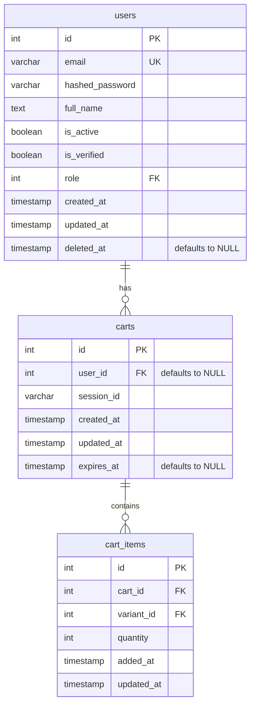
```mermaid
erDiagram
    %% User Domain
    users {
        int id PK
        varchar email UK
        varchar hashed_password
        text full_name
        boolean is_active
        boolean is_verified
        int role FK
        timestamp created_at
        timestamp updated_at
        timestamp deleted_at "defaults to NULL"
    }
    
    %% Cart Domain
    carts {
        int id PK
        int user_id FK "defaults to NULL"
        varchar session_id
        timestamp created_at
        timestamp updated_at
        timestamp expires_at "defaults to NULL"
    }
    
    cart_items {
        int id PK
        int cart_id FK
        int variant_id FK
        int quantity
        timestamp added_at
        timestamp updated_at
    }
    
    %% Relationships
    users ||--o{ carts : "has"
    carts ||--o{ cart_items : "contains"
```

#### CartItem

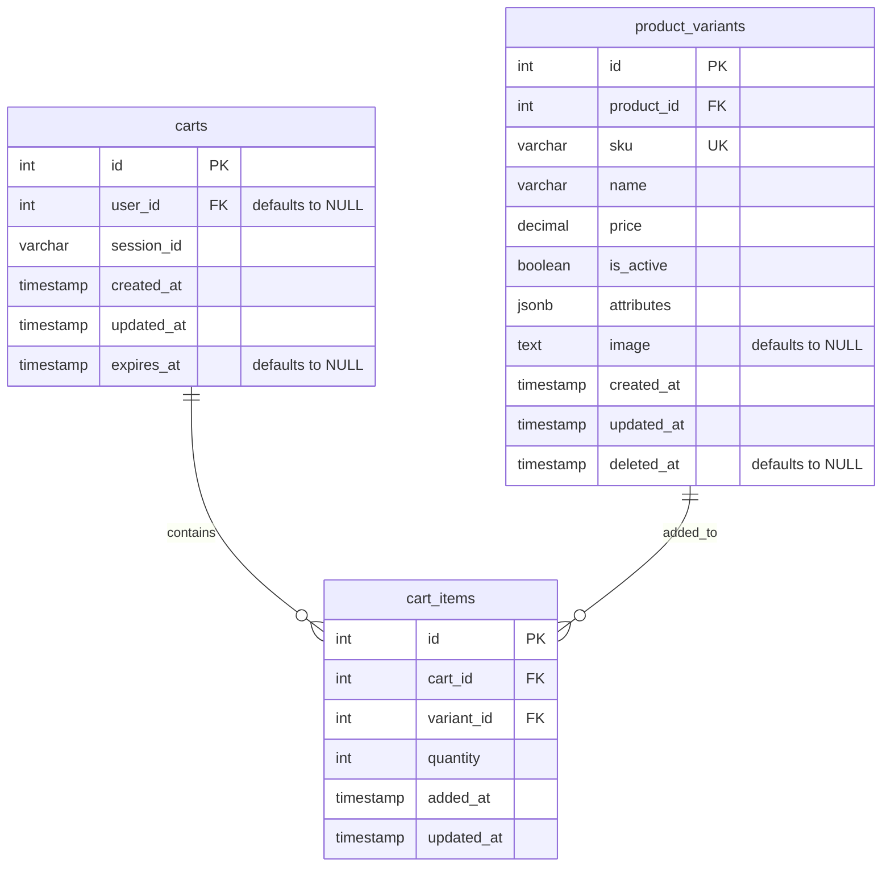
```mermaid
erDiagram
    product_variants {
        int id PK
        int product_id FK
        varchar sku UK
        varchar name
        decimal price
        boolean is_active
        jsonb attributes
        text image "defaults to NULL"
        timestamp created_at
        timestamp updated_at
        timestamp deleted_at "defaults to NULL"
    }
    
    %% Cart Domain
    carts {
        int id PK
        int user_id FK "defaults to NULL"
        varchar session_id
        timestamp created_at
        timestamp updated_at
        timestamp expires_at "defaults to NULL"
    }
    
    cart_items {
        int id PK
        int cart_id FK
        int variant_id FK
        int quantity
        timestamp added_at
        timestamp updated_at
    }
    
    %% Relationships
    carts ||--o{ cart_items : "contains"
    product_variants ||--o{ cart_items : "added_to"
```

#### carts
- `id`: integer PK (**Unique identifier for each cart**)
- `user_id`: integer FK -> users.id NULL (**Reference to the user who owns the cart (NULL for guest carts)**)
- `session_id`: varchar(255) (**Identifier for guest carts to maintain state**)
- `created_at`: timestamp
- `updated_at`: timestamp
- `expires_at`: timestamp NULL

#### cart_items
- `id`: integer PK (**Unique identifier for each cart item**)
- `cart_id`: integer FK -> carts.id (**Reference to the parent cart**)
- `variant_id`: integer FK -> product_variants.id (**Reference to the product variant**)
- `quantity`: integer (**Number of this item in the cart**)
- `added_at`: timestamp
- `updated_at`: timestamp

### Order Domain

#### Order

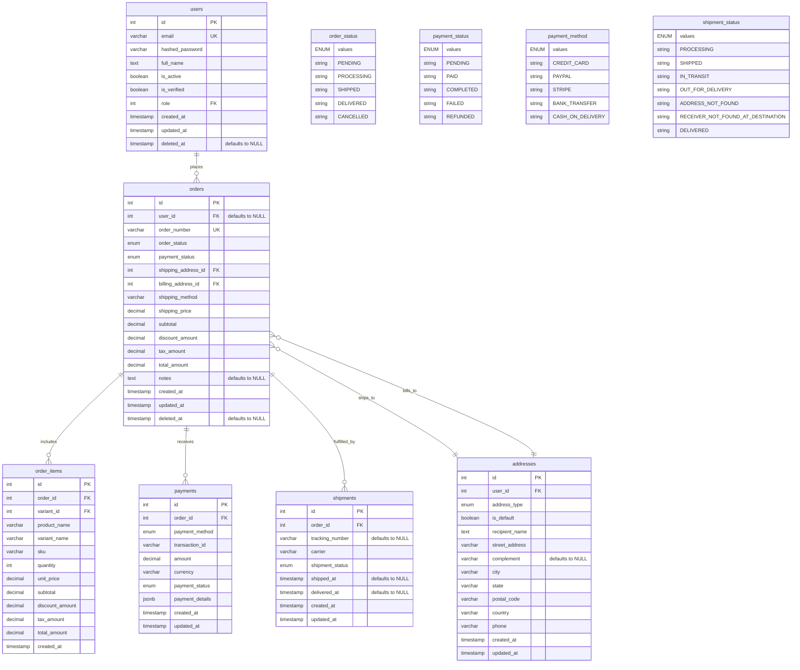
```mermaid
erDiagram
    %% User Domain
    users {
        int id PK
        varchar email UK
        varchar hashed_password
        text full_name
        boolean is_active
        boolean is_verified
        int role FK
        timestamp created_at
        timestamp updated_at
        timestamp deleted_at "defaults to NULL"
    }
    
    addresses {
        int id PK
        int user_id FK
        enum address_type
        boolean is_default
        text recipient_name
        varchar street_address
        varchar complement "defaults to NULL"
        varchar city
        varchar state
        varchar postal_code
        varchar country
        varchar phone
        timestamp created_at
        timestamp updated_at
    }
    
    %% Order Domain
    order_status {
        ENUM values
        string PENDING
        string PROCESSING
        string SHIPPED
        string DELIVERED
        string CANCELLED
    }
    
    payment_status {
        ENUM values
        string PENDING
        string PAID
        string COMPLETED
        string FAILED
        string REFUNDED
    }
    
    orders {
        int id PK
        int user_id FK "defaults to NULL"
        varchar order_number UK
        enum order_status
        enum payment_status
        int shipping_address_id FK
        int billing_address_id FK
        varchar shipping_method
        decimal shipping_price
        decimal subtotal
        decimal discount_amount
        decimal tax_amount
        decimal total_amount
        text notes "defaults to NULL"
        timestamp created_at
        timestamp updated_at
        timestamp deleted_at "defaults to NULL"
    }
    
    order_items {
        int id PK
        int order_id FK
        int variant_id FK
        varchar product_name
        varchar variant_name
        varchar sku
        int quantity
        decimal unit_price
        decimal subtotal
        decimal discount_amount
        decimal tax_amount
        decimal total_amount
        timestamp created_at
    }
    
    payment_method {
        ENUM values
        string CREDIT_CARD
        string PAYPAL
        string STRIPE
        string BANK_TRANSFER
        string CASH_ON_DELIVERY
    }

    payments {
        int id PK
        int order_id FK
        enum payment_method
        varchar transaction_id
        decimal amount
        varchar currency
        enum payment_status
        jsonb payment_details
        timestamp created_at
        timestamp updated_at
    }
    
    shipment_status {
        ENUM values
        string PROCESSING
        string SHIPPED
        string IN_TRANSIT
        string OUT_FOR_DELIVERY
        string ADDRESS_NOT_FOUND
        string RECEIVER_NOT_FOUND_AT_DESTINATION
        string DELIVERED
    }

    shipments {
        int id PK
        int order_id FK
        varchar tracking_number "defaults to NULL"
        varchar carrier
        enum shipment_status
        timestamp shipped_at "defaults to NULL"
        timestamp delivered_at "defaults to NULL"
        timestamp created_at
        timestamp updated_at
    }
    
    %% Relationships
    users ||--o{ orders : "places"
    orders ||--o{ order_items : "includes"
    orders ||--o{ payments : "receives"
    orders ||--o{ shipments : "fulfilled_by"
    orders }o--|| addresses : "ships_to"
    orders }o--|| addresses : "bills_to"
```

#### OrderItem

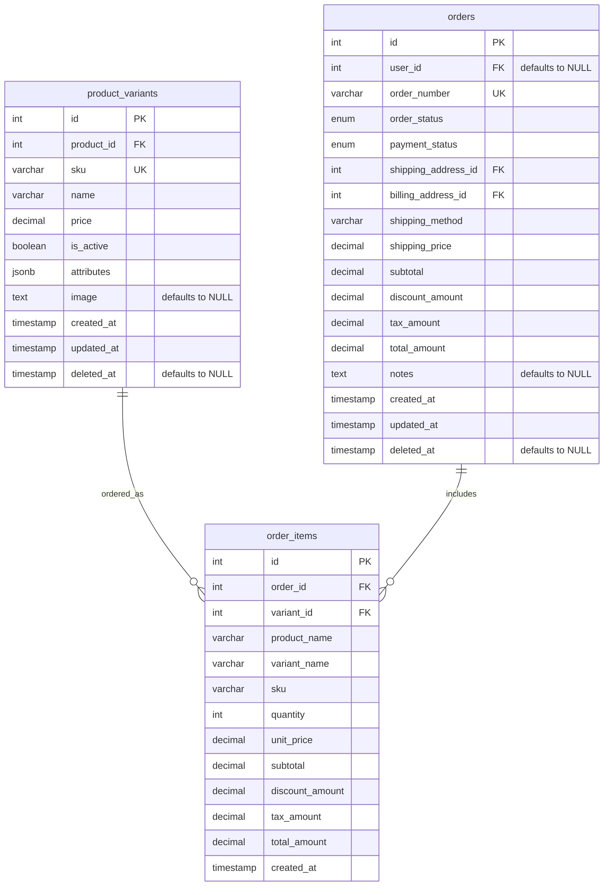
```mermaid
erDiagram
    product_variants {
        int id PK
        int product_id FK
        varchar sku UK
        varchar name
        decimal price
        boolean is_active
        jsonb attributes
        text image "defaults to NULL"
        timestamp created_at
        timestamp updated_at
        timestamp deleted_at "defaults to NULL"
    }
    
    %% Order Domain
    orders {
        int id PK
        int user_id FK "defaults to NULL"
        varchar order_number UK
        enum order_status
        enum payment_status
        int shipping_address_id FK
        int billing_address_id FK
        varchar shipping_method
        decimal shipping_price
        decimal subtotal
        decimal discount_amount
        decimal tax_amount
        decimal total_amount
        text notes "defaults to NULL"
        timestamp created_at
        timestamp updated_at
        timestamp deleted_at "defaults to NULL"
    }
    
    order_items {
        int id PK
        int order_id FK
        int variant_id FK
        varchar product_name
        varchar variant_name
        varchar sku
        int quantity
        decimal unit_price
        decimal subtotal
        decimal discount_amount
        decimal tax_amount
        decimal total_amount
        timestamp created_at
    }
    
    %% Relationships
    product_variants ||--o{ order_items : "ordered_as"
    orders ||--o{ order_items : "includes"
```

#### Payment

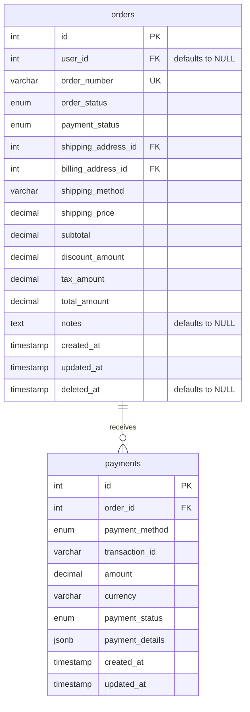
```mermaid
erDiagram
    %% Order Domain
    orders {
        int id PK
        int user_id FK "defaults to NULL"
        varchar order_number UK
        enum order_status
        enum payment_status
        int shipping_address_id FK
        int billing_address_id FK
        varchar shipping_method
        decimal shipping_price
        decimal subtotal
        decimal discount_amount
        decimal tax_amount
        decimal total_amount
        text notes "defaults to NULL"
        timestamp created_at
        timestamp updated_at
        timestamp deleted_at "defaults to NULL"
    }
    
    payments {
        int id PK
        int order_id FK
        enum payment_method
        varchar transaction_id
        decimal amount
        varchar currency
        enum payment_status
        jsonb payment_details
        timestamp created_at
        timestamp updated_at
    }
    
    %% Relationships
    orders ||--o{ payments : "receives"
```

#### Shipment

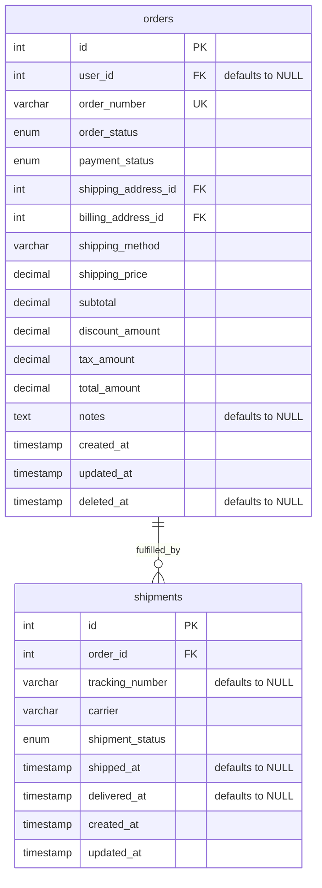
```mermaid
erDiagram
    %% Order Domain
    orders {
        int id PK
        int user_id FK "defaults to NULL"
        varchar order_number UK
        enum order_status
        enum payment_status
        int shipping_address_id FK
        int billing_address_id FK
        varchar shipping_method
        decimal shipping_price
        decimal subtotal
        decimal discount_amount
        decimal tax_amount
        decimal total_amount
        text notes "defaults to NULL"
        timestamp created_at
        timestamp updated_at
        timestamp deleted_at "defaults to NULL"
    }
    
    shipments {
        int id PK
        int order_id FK
        varchar tracking_number "defaults to NULL"
        varchar carrier
        enum shipment_status
        timestamp shipped_at "defaults to NULL"
        timestamp delivered_at "defaults to NULL"
        timestamp created_at
        timestamp updated_at
    }
    
    %% Relationships
    orders ||--o{ shipments : "fulfilled_by"
```

#### orders
- `id`: integer PK (**Unique identifier for each order**)
- `user_id`: integer FK -> users.id NULL (**Reference to the customer (NULL for guest orders)**)
- `order_number`: varchar(50) UK (**Human-readable unique order identifier**)
- `order_status`: enum ('PENDING', 'PROCESSING', 'SHIPPED', 'DELIVERED', 'CANCELED') (**Current status of the order**)
- `payment_status`: enum ('PENDING', 'PAID', 'FAILED', 'REFUNDED') (**Current status of the payment**)
- `shipping_address_id`: integer FK -> addresses.id (**Reference to the delivery address**)
- `billing_address_id`: integer FK -> addresses.id (**Reference to the billing address**)
- `shipping_method`: varchar(100) (**Selected shipping method**)
- `shipping_price`: decimal(10,2) (**Cost of shipping**)
- `subtotal`: decimal(10,2) (**Sum of all items before discounts and taxes**)
- `discount_amount`: decimal(10,2) (**Total amount of applied discounts**)
- `tax_amount`: decimal(10,2) (**Total amount of applied taxes**)
- `total_amount`: decimal(10,2) (**Final order amount after all adjustments**)
- `notes`: text NULL (**Customer or staff notes about the order**)
- `created_at`: timestamp
- `updated_at`: timestamp
- `deleted_at`: timestamp NULL (for soft delete)

#### order_items
- `id`: integer PK (**Unique identifier for each order item**)
- `order_id`: integer FK -> orders.id (**Reference to the parent order**)
- `variant_id`: integer FK -> product_variants.id (**Reference to the product variant**)
- `product_name`: varchar(150) (**Snapshot of product name at time of order**)
- `variant_name`: varchar(150) (**Snapshot of variant name at time of order**)
- `sku`: varchar(50) (**Snapshot of SKU at time of order**)
- `quantity`: integer (**Number of this item ordered**)
- `unit_price`: decimal(10,2) (**Price per unit at time of order**)
- `subtotal`: decimal(10,2) (**Line item total before discounts and taxes**)
- `discount_amount`: decimal(10,2) (**Discounts applied to this item**)
- `tax_amount`: decimal(10,2) (**Taxes applied to this item**)
- `total_amount`: decimal(10,2) (**Final line item amount after all adjustments**)
- `created_at`: timestamp

#### payments
- `id`: integer PK (**Unique identifier for each payment**)
- `order_id`: integer FK -> orders.id (**Reference to the associated order**)
- `payment_method`: enum ('CREDIT_CARD', 'PAYPAL', 'BANK_TRANSFER', 'CASH_ON_DELIVERY') (**Method used for payment**)
- `transaction_id`: varchar(100) (**External payment processor's transaction identifier**)
- `amount`: decimal(10,2) (**Payment amount**)
- `currency`: varchar(3) (**3-letter currency code from *ISO 4217***)
- `payment_status`: enum ('PENDING', 'COMPLETED', 'FAILED', 'REFUNDED') (**Current status of the payment**)
- `payment_details`: jsonb (**JSON containing additional payment details**)
- `created_at`: timestamp
- `updated_at`: timestamp

#### shipments
- `id`: integer PK (**Unique identifier for each shipment**)
- `order_id`: integer FK -> orders.id (**Reference to the associated order**)
- `tracking_number`: varchar(100) NULL (**Carrier's tracking number**)
- `carrier`: varchar(50) (**Shipping carrier name**)
- `shipment_status`: enum ('PROCESSING', 'SHIPPED', 'IN_TRANSIT', 'OUT_FOR_DELIVERY', 'ADDRESS_NOT_FOUND', 'RECEIVER_NOT_FOUND_AT_DESTINATION', 'DELIVERED') (**Current status of the shipment**)
- `shipped_at`: timestamp NULL
- `delivered_at`: timestamp NULL
- `created_at`: timestamp
- `updated_at`: timestamp

### Promotion Domain

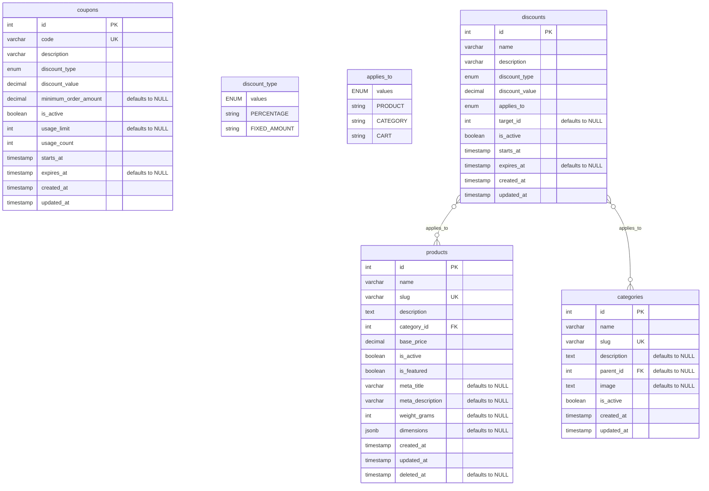
```mermaid
erDiagram
    %% Product Domain
    categories {
        int id PK
        varchar name
        varchar slug UK
        text description "defaults to NULL"
        int parent_id FK "defaults to NULL"
        text image "defaults to NULL"
        boolean is_active
        timestamp created_at
        timestamp updated_at
    }
    
    products {
        int id PK
        varchar name
        varchar slug UK
        text description
        int category_id FK
        decimal base_price
        boolean is_active
        boolean is_featured
        varchar meta_title "defaults to NULL"
        varchar meta_description "defaults to NULL"
        int weight_grams "defaults to NULL"
        jsonb dimensions "defaults to NULL"
        timestamp created_at
        timestamp updated_at
        timestamp deleted_at "defaults to NULL"
    }
    
    %% Promotion Domain
    coupons {
        int id PK
        varchar code UK
        varchar description
        enum discount_type
        decimal discount_value
        decimal minimum_order_amount "defaults to NULL"
        boolean is_active
        int usage_limit "defaults to NULL"
        int usage_count
        timestamp starts_at
        timestamp expires_at "defaults to NULL"
        timestamp created_at
        timestamp updated_at
    }
    
    discount_type {
        ENUM values
        string PERCENTAGE
        string FIXED_AMOUNT
    }

    applies_to {
        ENUM values
        string PRODUCT
        string CATEGORY
        string CART
    }
    
    discounts {
        int id PK
        varchar name
        varchar description
        enum discount_type
        decimal discount_value
        enum applies_to
        int target_id "defaults to NULL"
        boolean is_active
        timestamp starts_at
        timestamp expires_at "defaults to NULL"
        timestamp created_at
        timestamp updated_at
    }
    
    %% Relationships
    discounts }o--o{ products : "applies_to"
    discounts }o--o{ categories : "applies_to"
```

#### coupons
- `id`: integer PK (**Unique identifier for each coupon**)
- `code`: varchar(30) UK (**Unique code customers enter to apply the coupon**)
- `description`: varchar(200) (**Explanation of the coupon offer**)
- `discount_type`: enum ('PERCENTAGE', 'FIXED_AMOUNT') (**Whether this is a percentage or fixed amount discount**)
- `discount_value`: decimal(10,2) (**Amount or percentage to discount**)
- `minimum_order_amount`: decimal(10,2) NULL (**Minimum cart total required to use this coupon**)
- `is_active`: boolean (**Flag indicating if the coupon can be used**)
- `usage_limit`: integer NULL (**Maximum number of times the coupon can be used**)
- `usage_count`: integer (**Number of times the coupon has been used**)
- `starts_at`: timestamp
- `expires_at`: timestamp NULL
- `created_at`: timestamp
- `updated_at`: timestamp

#### discounts
- `id`: integer PK (**Unique identifier for each discount**)
- `name`: varchar(100) (**Administrative name for the discount**)
- `description`: varchar(200) (**Customer-facing description of the discount**)
- `discount_type`: enum ('PERCENTAGE', 'FIXED_AMOUNT') (**Whether this is a percentage or fixed amount discount**)
- `discount_value`: decimal(10,2) (**Amount or percentage to discount**)
- `applies_to`: enum ('PRODUCT', 'CATEGORY', 'CART') (**Scope of the discount (product, category, cart)**)
- `target_id`: integer NULL (**ID of the specific target (product or category) if applicable**)
- `is_active`: boolean (**Flag indicating if the discount is currently active**)
- `starts_at`: timestamp
- `expires_at`: timestamp NULL
- `created_at`: timestamp
- `updated_at`: timestamp

## Key Relationships

This ERD shows all tables with their:
- Primary keys (PK)
- Foreign keys (FK)
- Unique keys (UK)
- Nullable fields (NULL)
- Data types
- Cardinality relationships (one-to-one, one-to-many)
